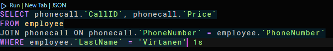
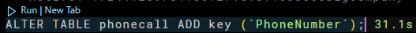
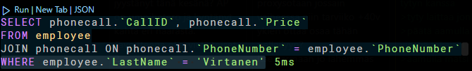

# Assignment_Indexing_v4.pdf

## Task 1

The database models the employees of a big comapny with a lot of data.
It contains the following tables:

- employees
- departments
- cars
- phonecalls
- postalareas

The database contains 5 tables. All but one tables have a relation with the employees table.
The only table without a relation is the phonecall table.

## Task 2

The queries are slow due to the lack of indexes. The queries are slow because the database has to scan the whole table to find the requested data.

## Task 3

We've speed up the querie by about 8ms by adding an index to the LastName field.

## Task 4

We've speed up the querie from 1.7s to just 3ms.

## Task 5

This query uses the lastname and phonenumbers fields.
With these imporovements we've sped ut the query from 1s to 5ms.
