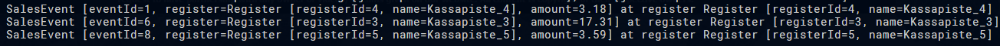
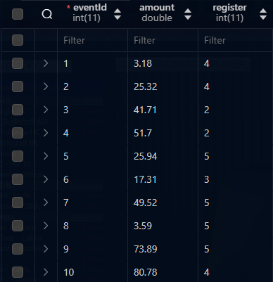
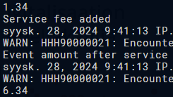

# jpa_jpql_v1.pdf

## Task 1

### A

```java
        public List<SalesEvent> retrieveSmallSales(double limit) {
            
            EntityManager em = emf.createEntityManager();
            em.getTransaction().begin();
            List<SalesEvent> result = null;
            
            Query query = em.createQuery("SELECT e FROM SalesEvent e WHERE e.amount < :limit");
            query.setParameter("limit", limit);

            result = query.getResultList();
            
            em.getTransaction().commit();
            em.close();
            return result;
        }
```





### B

```java
    public void addServiceFee(double fee) {
        EntityManager em = emf.createEntityManager();
        em.getTransaction().begin();

        Query query = em.createQuery("UPDATE SalesEvent e SET e.amount = e.amount + :fee");
        query.setParameter("fee", fee);

        query.executeUpdate();

        em.getTransaction().commit();
        em.close();
    }
```



In this example the service fee is set to 5

### C

```java
    public void deleteAllEvents() {
        EntityManager em = emf.createEntityManager();
        em.getTransaction().begin();

        Query query = em.createQuery("DELETE FROM SalesEvent e");
        query.executeUpdate();

        em.getTransaction().commit();
        em.close();
    }
```

## Task 2

### A

```java
        public List<SalesEvent> retrieveSmallSales(double limit) {
        
        EntityManager em = emf.createEntityManager();
        em.getTransaction().begin();
        List<SalesEvent> result = null;
        
        CriteriaBuilder cb = em.getCriteriaBuilder();
        CriteriaQuery<SalesEvent> cq = cb.createQuery(SalesEvent.class);

        Root<SalesEvent> salesEvent = cq.from(SalesEvent.class);
        cq.select(salesEvent);

        Predicate predicate = cb.lessThanOrEqualTo(salesEvent.get("amount"), limit);
        cq.where(predicate);

        TypedQuery<SalesEvent> query = em.createQuery(cq);

        result = query.getResultList();
        
        em.getTransaction().commit();
        em.close();
        return result;
    }
```

### B

```java
    public void addServiceFee(double fee) {
        EntityManager em = emf.createEntityManager();
        em.getTransaction().begin();

        CriteriaBuilder cb = em.getCriteriaBuilder();
        CriteriaUpdate<SalesEvent> cu = cb.createCriteriaUpdate(SalesEvent.class);

        Root<SalesEvent> salesEvent = cu.from(SalesEvent.class);
        cu.set(salesEvent.get("amount"), cb.sum(salesEvent.get("amount"), fee));

        Query query = em.createQuery(cu);
        query.executeUpdate();

        em.getTransaction().commit();
        em.close();
    }
```

### C

```java
    public void deleteAllEvents() {
        EntityManager em = emf.createEntityManager();
        em.getTransaction().begin();

        CriteriaBuilder cb = em.getCriteriaBuilder();
        CriteriaDelete<SalesEvent> cd = cb.createCriteriaDelete(SalesEvent.class);

        Root<SalesEvent> salesEvent = cd.from(SalesEvent.class);

        Query query = em.createQuery(cd);
        query.executeUpdate();

        em.getTransaction().commit();
        em.close();
    }
```

