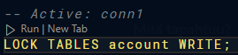
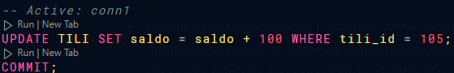

# harj_lukot_v2.pdf

## Task 1

The second connection is able to read the data
because the lock allows read.

The update is not possible because the lock does not allow write.

After unlocking the tables the query is able to update the data.

## Task 2

The read hangs.

After unlocking the tables the query is able to read the data with the interest added.
The lock stopped the query from reading the data.

## Task 3

The update hangs.

The update is possible after committing the transaction.

The update hangs because the tables are write locked.

## Task 4

