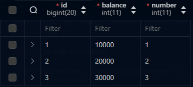
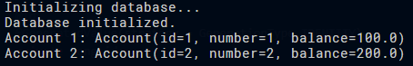
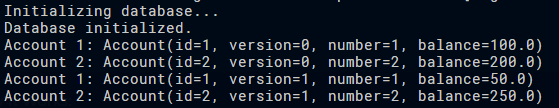
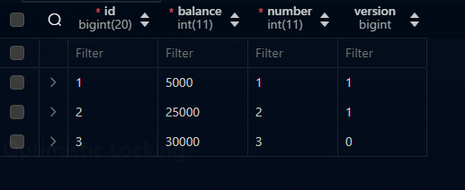

# jpa_conv_v1.pdf

## Task 1

```java

@Converter
public class BalanceConverter implements AttributeConverter<Double, Integer> {
    
    @Override
    public Integer convertToDatabaseColumn(Double attribute) {
        return (int) (attribute * 100);
    }

    @Override
    public Double convertToEntityAttribute(Integer dbData) {
        return dbData / 100.0;
    }
}

```

```java

@Data
@Builder
@Entity
@AllargsConstructor
@NoArgsConstructor
public class Account {
    
    @Id
    @GeneratedValue(strategy = GenerationType.IDENTITY)
    private Long id;

    private int number;

    @Convert(converter = BalanceConverter.class)
    private double balance; // in cents
}

```



## Task 2

```java
public Account getAccount(int number) {
    EntityManager em = emf.createEntityManager();
    Account account = em.find(Account.class, number);
    em.close();
    return account;
}
```



## Task 3

```java
public boolean transfer(int sourceAccountNumber, int destinationAccountNumber, double amount) {

    EntityManager em = emf.createEntityManager();
    em.getTransaction().begin();

    Account sourceAccount = em.find(Account.class, sourceAccountNumber);
    Account destinationAccount = em.find(Account.class, destinationAccountNumber);

    // Check if source account has enough balance
    if (sourceAccount.getBalance() < amount) {
        em.getTransaction().rollback();
        em.close();
        return false;
    }

    // Transfer amount
    sourceAccount.setBalance(sourceAccount.getBalance() - amount);
    destinationAccount.setBalance(destinationAccount.getBalance() + amount);

    em.getTransaction().commit();
    em.close();
    return true;
}
```

```java
@Data
@Builder
@Entity
@AllArgsConstructor
@NoArgsConstructor
public class Account {
    
    @Id
    @GeneratedValue(strategy = GenerationType.IDENTITY)
    private Long id;

    @Version
    private long version;

    private int number;

    @Convert(converter = BalanceConverter.class)
    private double balance; // in cents
}
```

Console



Database

