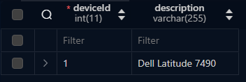
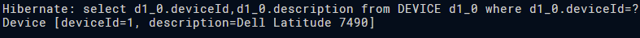
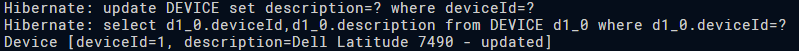
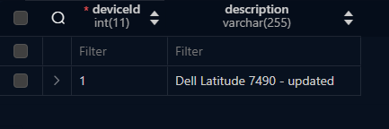
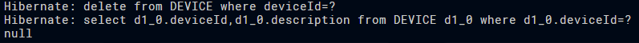

# jpa_jakarta_onetable_v2.pdf

## Task1



## Task2

```java
    public void getDevice(int id) {
            EntityManager em = emf.createEntityManager();
            em.getTransaction().begin();
            
            Device device = em.find(Device.class, id);
            System.out.println(device);
            
            em.getTransaction().commit();
            em.close();
        }
```



## Task3

```java
    public boolean updateDeviceDescription(int id, String description) {
            EntityManager em = emf.createEntityManager();
            em.getTransaction().begin();
            
            Device device = em.find(Device.class, id);
            if (device == null) {
                em.getTransaction().commit();
                em.close();
                return false;
            }
            
            Device newDevice = new Device(description);
            newDevice.setDeviceId(device.getDeviceId());
            
            em.merge(newDevice);
            em.getTransaction().commit();
            em.close();

            return true;
        }
```





## Task4

```java
    @Id
        @GeneratedValue(strategy=GenerationType.IDENTITY)
        @Column(name="deviceId", nullable=false)
        private int deviceId;
```

## Task5

```java
        public void deleteDevice(int id) {
            EntityManager em = emf.createEntityManager();
            em.getTransaction().begin();
            
            Device device = em.find(Device.class, id);
            if (device != null) {
                em.remove(device);
            }
            
            em.getTransaction().commit();
            em.close();
        }
```


