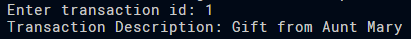
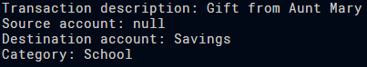

# jpa_onetomany_v1.pdf

## Task1

```java

    @ManyToOne
    @JoinColumn(name = "CategoryId")
    private Category category;

    @ManyToOne
    @JoinColumn(referencedColumnName = "AccountId")
    private Account SourceAccount;

    @ManyToOne
    @JoinColumn(referencedColumnName = "AccountId")
    private Account TargetAccount;

```

## Task2

```java

Dao dao = new Dao();

        // Generate a few categories (food, leisure, school, gifts, internal transfer etc.)
        dao.createCategory("Food");
        dao.createCategory("Leisure");
        dao.createCategory("School");
        dao.createCategory("Gifts");
        dao.createCategory("Internal Transfer");

        // Generate a savings account with a € 400.00 balance.
        dao.createAccount("Savings", 400.00);

        // Generate a wallet with a € 14.50 balance.
        dao.createAccount("Wallet", 14.50);

        // Receive a gift of € 100.00 from Aunt Mary to the savings account. (The sourceaccount should be null.)
        dao.createTransaction(10000, "Gift from Aunt Mary", 3L, null, "Savings");

        // Transfer € 40.00 from the savings account to the wallet (internal transfer;
        // specify both the source and destination accounts).

        dao.createTransaction(4000, "Transfer to Wallet", 5L, "Savings", "Wallet");

        // Spend € 8.40 from the wallet in the pub. (The target account should be null).

        dao.createTransaction(840, "Spend in the pub", 2L, "Wallet", null);

```

```java
private EntityManagerFactory emf = Persistence.createEntityManagerFactory("DevPU");

    public void createCategory(String categoryDescription) {
        EntityManager em = emf.createEntityManager();
        em.getTransaction().begin();
        Category category = new Category();
        category.setCategoryDescription(categoryDescription);
        em.persist(category);
        em.getTransaction().commit();
        em.close();
    }

    public Category findCategory(Long categoryId) {
        EntityManager em = emf.createEntityManager();
        Category category = em.find(Category.class, categoryId);
        em.close();
        return category;
    }

    public void updateCategory(Long categoryId, String categoryDescription) {
        EntityManager em = emf.createEntityManager();
        em.getTransaction().begin();
        Category category = em.find(Category.class, categoryId);
        category.setCategoryDescription(categoryDescription);
        em.getTransaction().commit();
        em.close();
    }

    public void createAccount(String accountName, double balance) {
        EntityManager em = emf.createEntityManager();
        em.getTransaction().begin();
        Account account = new Account();
        account.setAccountName(accountName);
        account.setBalance(balance);
        em.persist(account);
        em.getTransaction().commit();
        em.close();
    }

    public Account findAccount(String accountName) {
        EntityManager em = emf.createEntityManager();
        Account account = em.createQuery("SELECT a FROM Account a WHERE a.AccountName = :accountName", Account.class)
                            .setParameter("accountName", accountName)
                            .getSingleResult();
        em.close();
        return account;

    }

    public void updateAccount(Long accountId, String accountName, double balance) {
        EntityManager em = emf.createEntityManager();
        em.getTransaction().begin();
        Account account = em.find(Account.class, accountId);
        account.setAccountName(accountName);
        account.setBalance(balance);
        em.getTransaction().commit();
        em.close();
    }

    public void createTransaction(int amount, String description, 
                                Long categoryId, String sourceAccountName, String destinationAccountName) {
        
        EntityManager em = emf.createEntityManager();
        em.getTransaction().begin();
        Transaction transaction = new Transaction();
        transaction.setAmount(amount);
        transaction.setDescription(description);
        transaction.setCategory(findCategory(categoryId));

        // Check if either account is null
        if (sourceAccountName != null) {
            transaction.setSourceAccount(findAccount(sourceAccountName));
        } else {
            transaction.setSourceAccount(null);
        }

        if (destinationAccountName != null) {
            transaction.setDestinationAccount(findAccount(destinationAccountName));
        } else {
            transaction.setDestinationAccount(null);
        }
        
        em.persist(transaction);
        em.getTransaction().commit();
        em.close();
    }
```

## Task3



```java	

public static void main (String[] args) {

        Dao dao = new Dao();

        Scanner scanner = new Scanner(System.in);
        System.out.print("Enter transaction id: ");
        int transactionId = scanner.nextInt();
        scanner.close();

        String transactionDescription = dao.getTransactionDescriptionById(transactionId);
        System.out.println("Transaction Description: " + transactionDescription);
    }

```

```java

    public String getTransactionDescriptionById(int transactionId) {
        EntityManager em = emf.createEntityManager();
        Transaction transaction = em.find(Transaction.class, (long) transactionId);
        em.close();

        // Check if the transaction is null
        return transaction != null ? transaction.getDescription() : "Transaction not found";
    }

```

## Task4



```java

public static void main (String[] args) {

        Dao dao = new Dao();

        Scanner scanner = new Scanner(System.in);
        System.out.print("Enter transaction id: ");
        int transactionId = scanner.nextInt();
        scanner.close();

        Transaction trans = dao.getTransactionById(transactionId);
        
        // Get description
        String description = trans.getDescription();
        String source = trans.getSourceAccount() != null ? trans.getSourceAccount().getAccountName() : "null";
        String destination = trans.getDestinationAccount() != null ? trans.getDestinationAccount().getAccountName() : "null";
        String category = trans.getCategory().getCategoryDescription();

        System.out.println("Transaction description: " + description);
        System.out.println("Source account: " + source);
        System.out.println("Destination account: " + destination);
        System.out.println("Category: " + category);

        scanner.close();
    }

```

```java

    public Transaction getTransactionById(int transactionId) {
        EntityManager em = emf.createEntityManager();
        Transaction transaction = em.find(Transaction.class, (long) transactionId);
        em.close();
        return transaction != null ? transaction : null;
    }

```

