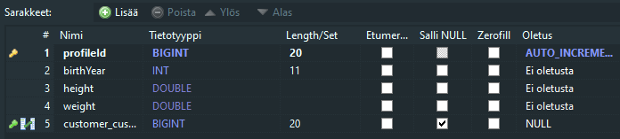
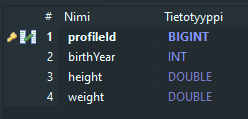

# jpa_onetoone_v1.pdf

## Task 1

```java

@Data
@Builder
@Entity
public class Customer {
    
    @Id
    @GeneratedValue(strategy = GenerationType.IDENTITY)
    private long custId;
    
    @OneToOne(mappedBy = "customer", cascade = CascadeType.ALL)
    private BasicProfile basicProfile;

    private String firstName;

    private String lastName;
}

```



## Task 2

```java

@Data
@Builder
@Entity
public class Customer {
    
    @Id
    @GeneratedValue(strategy = GenerationType.IDENTITY)
    @Column(unique = true, nullable = false)
    private long custId;
    
    @OneToOne(mappedBy = "customer", cascade = CascadeType.PERSIST, orphanRemoval = true)
    @PrimaryKeyJoinColumn
    private BasicProfile basicProfile;

    private String firstName;
    private String lastName;
}

```

```java

@Data
@Builder
@Entity
public class BasicProfile {
    
    @Id
    @Column(name = "profileId")
    private long profileId;

    @OneToOne
    @MapsId
    @JoinColumn(name = "profileId")
    private Customer customer;

    private int birthYear;
    private double weight;
    private double height;

}

```



## Task 3

what does this even mean?