# Assignment_Indexing_v4.pdf

## Task 1

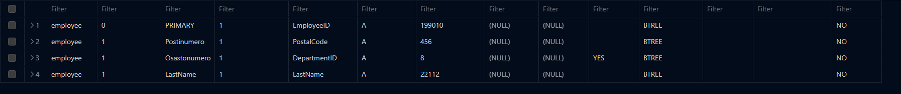

You can verify the existance of and index by running the SHOW INDEX command
on a specified table or database. The command will return a list of indexes.

## Task 2

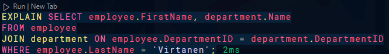
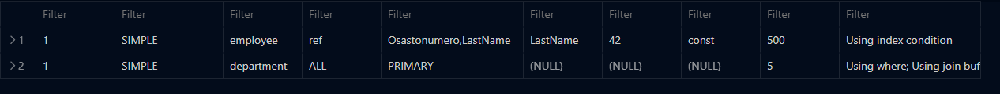

The EXPLAIN command in SQL is used to analyze and provide information about how a specific SQL query will be executed by the database engine. It helps in understanding the execution plan and performance of the query.

## Task 3

The `FORCE INDEX` tells the query optimizer to use the specified index for the query.

The `USE INDEX` suggests to the query optimizer to consider the specified indexes when executing the query. It does not force the optimizer to use the index.

The `IGNORE INDEX` tells the query optimizer to ignore the specified indexes when executing the query.

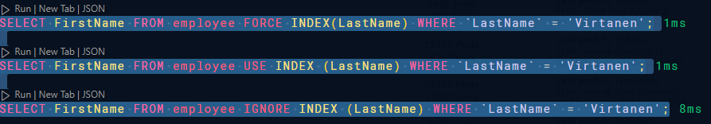

## Task 4

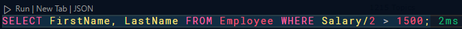

Adding the force tag to the query.

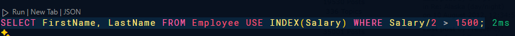

The index has no effect on the query time.

## Task 5

(Side note! The query example for creating the index is plainly wrong)

Creating the index.

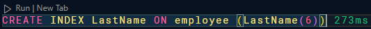

Index with length of 2

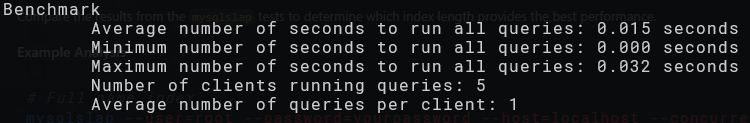

Index with length of 4

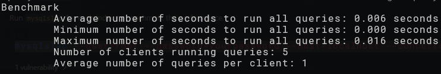

Index with length of 6

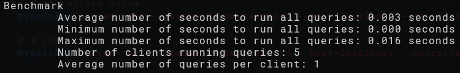

Index with length of 8

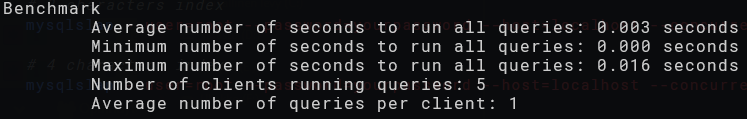

The first 6 characters seems to be enough for the index to be as effective as possible.

## Task 6

(Side note! There is no such variable as "slow_queries_log" in MySQL)

Cant be assed to debug the log file.