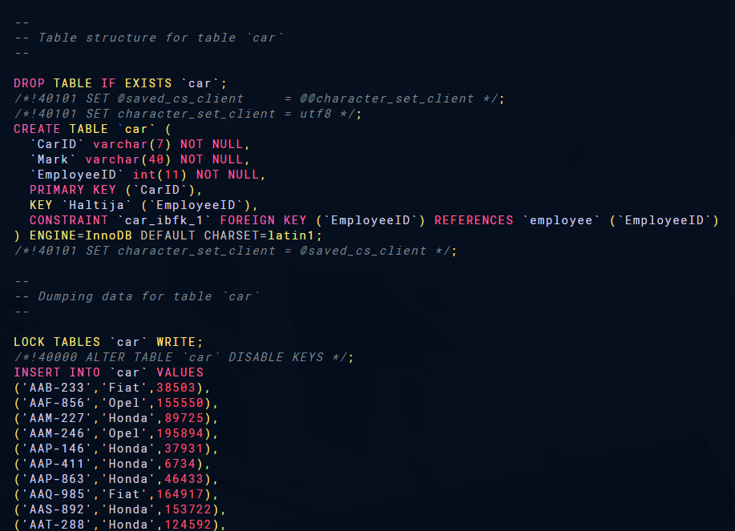
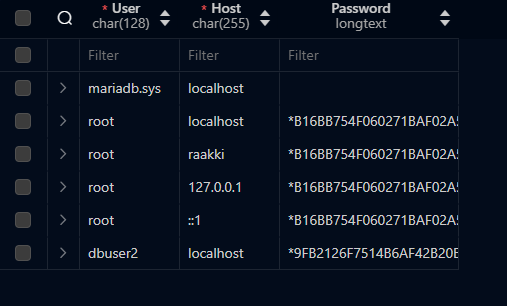
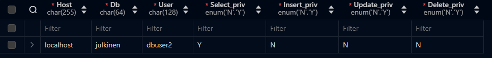
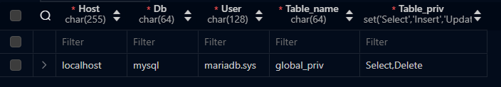

# harj_tietoruva_v2.pdf

## Task 1

Created with `mysqldump`

## Task 2

Userdetails are saved to mysql.user table.

Credentials are saved as follows:

- `mysql.db`: Database-level privileges
- `mysql.tables_priv`: Table-level privileges
- `mysql.columns_priv`: Column-level privileges
- `mysql.procs_priv`: Stored procedure and function privileges

## Task 3

### Database Administrator's Checklist

1. **Data Minimization**
   - Collect and store only necessary data.
   - Reduces risk and ensures compliance.
   - **Source**: [GDPR Article 5(1)(c)](https://gdpr-info.eu/art-5-gdpr/)

2. **Data Encryption**
   - Encrypt data at rest and in transit.
   - Protects data confidentiality.
   - **Source**: [GDPR Article 32(1)(a)](https://gdpr-info.eu/art-32-gdpr/)

3. **Access Control**
   - Implement strict access controls.
   - Limits data access to authorized personnel.
   - **Source**: [GDPR Article 32(1)(b)](https://gdpr-info.eu/art-32-gdpr/)

4. **Regular Audits**
   - Conduct regular compliance audits.
   - Identifies vulnerabilities and ensures ongoing compliance.
   - **Source**: [GDPR Article 24(1)](https://gdpr-info.eu/art-24-gdpr/)

5. **Data Breach Response Plan**
   - Maintain a data breach response plan.
   - Ensures quick response to breaches.
   - **Source**: [GDPR Article 33](https://gdpr-info.eu/art-33-gdpr/)

### References

- [Europa GDPR Overview](https://europa.eu/youreurope/business/dealing-with-customers/data-protection/data-protection-gdpr/index_en.htm)
