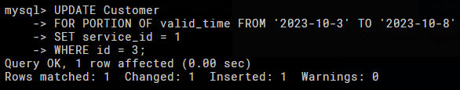
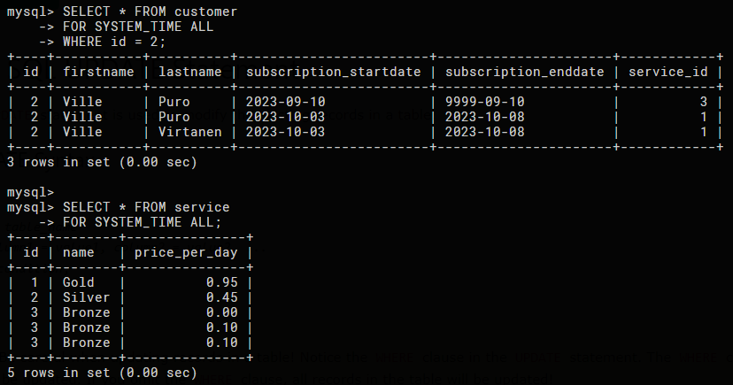
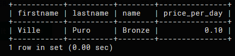

# assignment_temporal.pdf

## Task 1

```sql
CREATE TABLE Service (
    id INT(20) NOT NULL,
    name VARCHAR(50) NOT NULL,
    price_per_day DECIMAL(20, 2) NOT NULL,
    PRIMARY KEY (id)
) WITH SYSTEM VERSIONING;

CREATE TABLE Customer (
    id INT(20) NOT NULL AUTO_INCREMENT,
    fistname VARCHAR(50) NOT NULL,
    lastname VARCHAR(50) NOT NULL,
    subscription_startdate DATE NOT NULL,
    subscription_enddate DATE NOT NULL,
    service_id INT(20) NOT NULL,
    PERIOD FOR valid_time (subscription_startdate, subscription_enddate),
    PRIMARY KEY (id),
    FOREIGN KEY (service_id) REFERENCES Service(id)
) WITH SYSTEM VERSIONING;

```

## Task 2

```sql
/* Inserting data into the Service table */
INSERT INTO Service (id, name, price_per_day) VALUES (1, 'Gold', 0.95);
INSERT INTO Service (id, name, price_per_day) VALUES (2, 'Silver', 0.45);
INSERT INTO Service (id, name, price_per_day) VALUES (3, 'Bronze', 0.00);

/* Inserting data into the Customer table */
INSERT INTO Customer (firstname, lastname, subscription_startdate, subscription_enddate, service_id)
VALUES ('Mary', 'Smith', '2023-9-1', '2023-9-9', 2)

INSERT INTO Customer (firstname, lastname, subscription_startdate, subscription_enddate, service_id)
VALUES ('Ville', 'Puro', '2023-9-10', '9999-9-10', 3)
```

## Task 3

```sql
UPDATE Customer 
FOR PORTION OF valid_time FROM '2023-10-3' TO '2023-10-8'
SET service_id = 1
WHERE id = 3;
```



## Task 4

```sql
UPDATE Customer
SET lastname = 'Virtanen'
WHERE id = 3;

UPDATE Service
SET price_per_day = 0.10
WHERE id = 3;

SELECT * FROM customer
FOR SYSTEM_TIME ALL
WHERE id = 2;

SELECT * FROM service
FOR SYSTEM_TIME ALL;
```



## Task 5

```sql
SELECT customer.firstname, customer.lastname,
service.name, Service.price_per_day
FROM customer
INNER JOIN Service ON customer.service_id = Service.id
WHERE TIMESTAMP('2023-9-11') BETWEEN subscription_startdate AND subscription_enddate;
```


