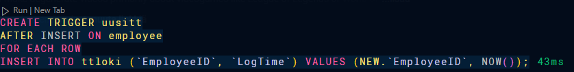

# harj_liipaisimet_yms_v2.pdf

## Task 1

The `SHOW CREATE TRIGGER` statement shows the name of the trigger, the trigger body,
as well as some other information such as the time the trigger was created.

## Task 2

The event triggers every minute, and logs the current timestamp and the number of employees.

## Task 3

One row size:

- 4 bytes `int(11)`
- 4 bytes `timestamp`

Total: 8 bytes

1Gb = 1024Mb = 1024 * 1024 Kb = 1024 * 1024 * 1024 bytes

1024 * 1024 * 1024 / 8 = 134,217,728 rows

Row is created every minute, so it takes 134,217,728 minutes to get to 1Gb.

134,217,728 / 60 = 2,236,962 hours

2,236,962 / 24 = 93,206 days

93,206 / 365 = 255 years.

## Task 4

When the procedure is called, it will select the salary of the employee with
the given ID and return it. If the employee does not exist, it will return nothing.
