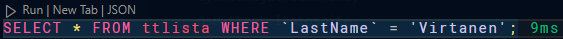

# näkymät_harj.pdf

## Task 1

## Task 2

## Task 3

The command list all tables in the database
as well as all the views.

## Task 4

Changing values in the table the view is based on
will also affect the view.

## Task 5

Changing values in the view will also affect the table.

## Task 6

Changing the postalarea in the view will also affect the postalarea table.
Everyone with the same postalcode will have the same postalarea.

## Task 7

## Task 8

The new user is able to see the view even though the user does not have access to the table the view is based on.
This is because the view is based on the table and the user has access to the view.

## Task 9

The user is unable to update the view because the view is linked to the table and the user does not have access to the table.

## Task 10

The employees wage is updated because the view is linked to the table.

## Task 11

The employees wage is not updated because of the CHECK constraint in the view. It means that every inserted row must be checked against defined rules.
